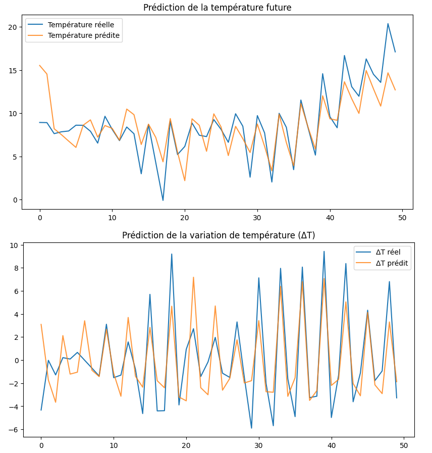

# Weather Forecasting: A Comparative Study of XGBoost and LSTM Models

This repository presents a comparative analysis between **gradient boosting methods (XGBoost)** and **LSTM neural networks** for **short-term temperature prediction**.  
The study explores how classical machine learning models can rival deep learning methods on structured meteorological time series when proper feature engineering and temporal framing are applied.

---

## Abstract

Time series forecasting is an essential component of modern data-driven meteorology.  
This project focuses on predicting both **absolute temperature** and **temperature variation (ΔT)** using different modeling paradigms.  
By leveraging cyclic temporal encoding, sliding window sampling, and autoregressive prediction, the notebook aims to evaluate model accuracy, stability, and interpretability across approaches.

---

## 1. Data Preparation

The dataset consists of historical meteorological observations including:
- Temperature (°C)
- Apparent temperature
- Humidity
- Wind speed and direction
- Atmospheric pressure
- Visibility

Data preprocessing involves:
- Converting timestamps into standard `datetime` format
- Creating temporal features (`hour`, `day`, `month`, `dayofweek`)
- Aggregating hourly data into three daily periods: **morning**, **afternoon**, and **night**
- Shifting early morning observations (before 6:00) to the previous day to maintain consistency in daily cycles

This transformation ensures temporal continuity and eliminates noise from overlapping time intervals.

---

## 2. Feature Engineering

To better represent periodic temporal dependencies, cyclic encoding is applied to calendar-based variables:

$$
x_{sin} = \sin\left(2 \pi \frac{x}{P}\right), \quad
x_{cos} = \cos\left(2 \pi \frac{x}{P}\right)
$$

where:
- \( x \) is the feature value (e.g., day of month, month, day of week)
- \( P \) is the full period of the cycle (31, 12, or 7)

Additional engineered features include:
- Temperature variation \( \Delta T = T_t - T_{t-1} \)
- Normalized trigonometric encodings of daily, monthly, and weekly periodicity
- Environmental predictors such as humidity, wind bearing, visibility, and pressure

These engineered variables significantly enhance model interpretability and help capture seasonality and short-term cyclic trends.

---

## 3. Data Normalization and Sequence Generation

Both inputs and targets are scaled using **Min-Max normalization** to the range [0, 1]:

$$
x' = \frac{x - x_{min}}{x_{max} - x_{min}}
$$

Sliding windows of fixed length (typically 24–42 hours) are then used to generate supervised sequences:
- Each input sample represents a window of past meteorological states
- Each target represents the temperature or ΔT for the next step

This structure allows both classical models (XGBoost) and sequential models (LSTM) to learn temporal dependencies effectively.

---

## 4. Modeling Approaches

### XGBoost
- Uses flattened input sequences (`window × n_features`) as tabular data.
- Captures short-term nonlinear relationships through gradient boosting trees.
- Trained to predict both temperature and ΔT simultaneously (multi-output regression).

### LSTM
- Receives 3D input tensors preserving the sequential order.
- Learns long-term dependencies directly through recurrent connections.
- More sensitive to dataset size, scaling, and hyperparameter tuning.

Both models are trained with a non-random temporal split (80% training, 20% testing) to prevent data leakage.

---

## 5. Evaluation Metrics

Model performance is evaluated using:
- **Mean Squared Error (MSE)**
- **Root Mean Squared Error (RMSE)**
- **Coefficient of Determination (R²)**

Predicted temperature values are reconstructed from cumulative ΔT to evaluate real-world interpretability.

---

## 6. Visualization of Predictions

The figure below illustrates the predictive performance of XGBoost on unseen test data.

  

- The first plot shows the **true vs. predicted temperature**.
- The second plot compares **true vs. predicted temperature variations (ΔT)**.

The results indicate that XGBoost captures both the short-term temperature patterns and the general trend, demonstrating robustness and stability even with limited data.

---

## 7. Results and Discussion

| Model   | Target | RMSE  | R²   | Remarks |
|----------|---------|-------|------|----------|
| XGBoost | ΔT | ≈2.2 | 0.81 | Stable, interpretable, efficient for small datasets |
| LSTM | ΔT | ≈3.1 | 0.70 | Better long-term potential, but needs more data and tuning |

### Observations:
- **XGBoost** achieved higher R² scores on ΔT prediction and reconstructed temperatures.
- **LSTM** tended to overfit with small datasets, requiring more epochs and regularization.
- The feature engineering step significantly influenced both models’ performance.
- Gradient boosting handled noise and limited data more efficiently, while LSTM excelled in capturing complex temporal interactions once adequately trained.

---

## 8. Key Insights

1. Feature engineering and data structure can outweigh model complexity in time-series forecasting.
2. Classical boosting methods remain competitive with deep learning on structured and well-engineered datasets.
3. LSTM networks are advantageous when abundant, continuous, and high-frequency data are available.
4. Autoregressive prediction helps visualize long-horizon performance and stability.
5. Combining boosting with neural embeddings (hybrid models) could provide future performance gains.

---

## 9. Tools and Dependencies

- Python 3.10
- pandas, NumPy, scikit-learn
- XGBoost, PyTorch
- Matplotlib, Seaborn

##  Author
**Nawfal Benhamdane**  
📧 nawfal.benhamdane@student-cs.fr  
💻 [GitHub Profile](https://github.com/nawfalbenhamdane)
